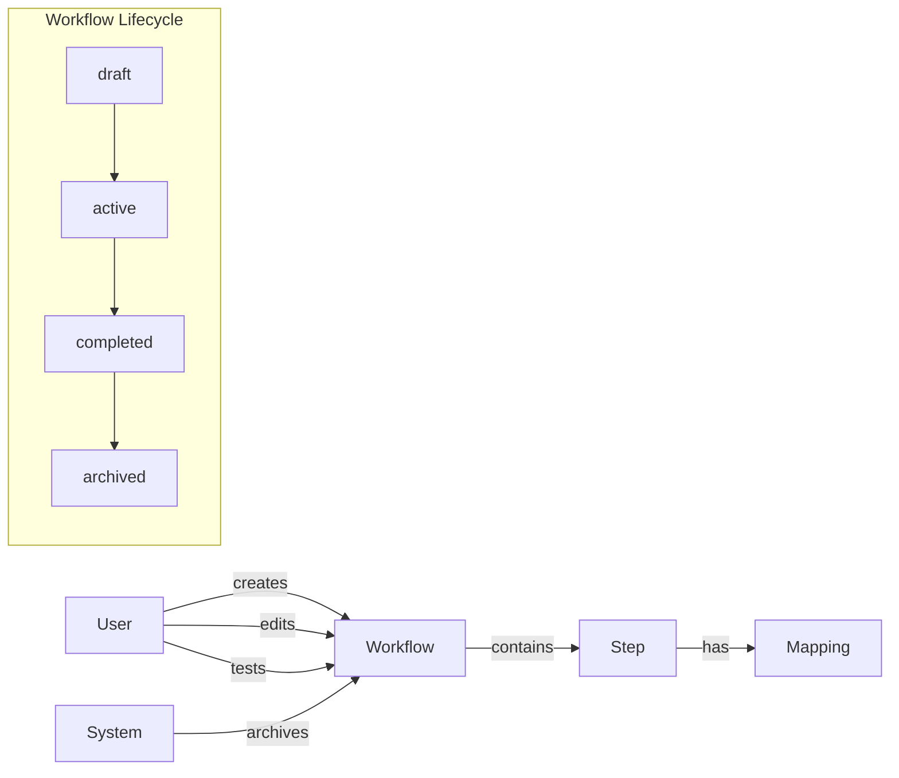

# PLAN.md — Logline CLI 4-Week Development Plan

> **How to use:** Tell Claude Code `Read PLAN.md and execute Day X` where X is the day you're working on. Each day has full context, specific tasks, and verification steps.

---

## Strategic Positioning

Logline is the **semantic layer for product analytics** — the missing piece between event delivery infrastructure (GlassFlow, OTLP, webhooks) and the agents/tools that reason over that data (LangChain, LangGraph, dbt).

The AI agent ecosystem has tools for reasoning, orchestration, durable execution, and data delivery. But none of them answer: **what events exist, what do they mean, and how do they relate to each other?**

`tracking-plan.json` is a **machine-readable product ontology**:
- **Event definitions** with properties and types → the schema agents need to parse events
- **Actor/object relationships** → the JOIN paths agents need to correlate events
- **Lifecycle states** (draft → active → completed) → the state machine agents need to understand sequences
- **Expected sequences** → what agents use for anomaly detection
- **Metric definitions** with formulas → the questions agents can answer without being prompted

The stack:
```
Logline generates the schema     → tracking-plan.json
Your app emits events            → track('workflow_created', {...})
GlassFlow / OTLP delivers them   → Filters, normalizes, context windows
Agent reads tracking-plan.json   → Knows what events mean, how they correlate, what's anomalous
```

**Month 1 (this plan):** Open-source CLI that generates high-quality tracking plans from codebases.
**Month 2:** GitHub App ($5/mo) that detects tracking gaps on PRs + auto-instruments.
**Future:** The tracking plan becomes the standard contract between product code, data pipelines, and AI agents.

---

## Current State (before Day 1)

~2,200 lines TypeScript, 11 source files, 3 CLI commands (scan, spec, pr).

**File structure:**
```
packages/
  agent-core/src/memory/style-learner.ts  (67 lines, DEAD — imports non-existent SemanticMemoryStore)
  types/src/index.ts                       (441 lines, rich types NOT used by CLI)
src/
  app/api/generate-pr/route.ts             (DEAD STUB)
  cli.ts                                   (127 lines — CLI entry, registers scan/spec/pr commands)
  commands/scan.ts                         (567 lines — monolithic scan pipeline)
  commands/spec.ts                         (123 lines — writes per-event JSON files)
  commands/pr.ts                           (370 lines — generates PR with tracking code)
  lib/types.ts                             (29 lines — simplified types, DUPLICATE of packages/types)
  lib/analyzers/business-reasoner.ts       (219 lines — LLM product analysis)
  lib/discovery/interaction-scanner.ts     (346 lines — regex-based interaction detection + naming)
  lib/discovery/tracking-gap-detector.ts   (96 lines — compares detected vs existing events)
  lib/utils/code-generator.ts             (222 lines — generates track() calls)
  lib/utils/event-name.ts                 (85 lines — validates/cleans event names)
  lib/utils/location-finder.ts            (193 lines — finds insertion points)
```

**Key problems:**
1. Two incompatible type systems (packages/types rich but unused, src/lib/types minimal)
2. Scan produces garbage event names (save_saved, add_added)
3. Per-event JSON spec files instead of single tracking plan
4. Code generator guesses properties without checking scope
5. Only tested on Lovable-generated React projects
6. No tests, dead code everywhere

---

## Day 1 — Type Consolidation + Cleanup

### Context
Two type systems exist: `src/lib/types.ts` (29 lines, used by CLI) and `packages/types/src/index.ts` (441 lines, rich but disconnected). Dead code exists in `packages/agent-core/` and `src/app/`.

### Tasks

**Step 1: Delete dead code**
- Delete `packages/agent-core/` entirely
- Delete `src/app/` directory entirely
- Check if `src/lib/services/scan-service.ts` is imported anywhere — if not, delete it

**Step 2: Consolidate types**
- Take all types from `packages/types/src/index.ts` and merge into `src/lib/types.ts`
- The result: `src/lib/types.ts` becomes the SINGLE source of truth for ALL types
- Keep everything from `packages/types/src/index.ts`: Actor, TrackedObject, InteractionTypes, ObjectLifecycle, PRContext, EventSuggestion, SemanticMemory, DualClassification, BulkAction, ContextProperty, etc.
- Also keep existing types from current `src/lib/types.ts`: FileContent, CodeLocation, ProductProfile, DetectedEvent
- Deduplicate: both define `CodeLocation` — the packages/types version is richer, keep that one but ensure compatibility with how CLI uses it
- Remove the `export * from './constants'` line if there's no constants file
- Delete `packages/types/` then `packages/` directory entirely

**Step 3: Fix all imports**
- Search every `.ts` file in `src/` for imports from `@logline/types` → change to relative import from `../lib/types`
- Remove any references to deleted paths
- The `TrackingGap` type exists in BOTH `packages/types` and `src/lib/discovery/tracking-gap-detector.ts` with different shapes. The `tracking-gap-detector.ts` version is what `scan.ts` imports. Keep that import working — either move TrackingGap into consolidated types.ts and re-export from tracking-gap-detector.ts, or leave it in tracking-gap-detector.ts. Pick whichever creates fewer import changes.

**Step 4: Clean up config files**
- In `package.json`: remove any `workspaces` config
- In `tsconfig.json`: remove path aliases to `@logline/types` or `packages/*`

**Step 5: Add TrackingPlan types**
Add to the END of `src/lib/types.ts`:

```typescript
// ─── Tracking Plan Format ───

export interface TrackingPlan {
  version: string;
  generatedAt: string;
  generatedBy: string;
  product: ProductProfile;
  events: TrackingPlanEvent[];
  context?: TrackingPlanContext;
  metrics?: TrackingPlanMetric[];
  /** Expected event sequences for anomaly detection by agents */
  expectedSequences?: ExpectedSequence[];
  coverage: CoverageStats;
}

export interface TrackingPlanEvent {
  id: string;                    // stable ID: "evt_<hash of name>"
  name: string;                  // "workflow_edited"
  description: string;
  actor: string;                 // "User"
  object: string;                // "Workflow"
  action: string;                // "edited"
  properties: EventProperty[];
  locations: CodeLocation[];
  priority: 'critical' | 'high' | 'medium' | 'low';
  status: 'suggested' | 'approved' | 'implemented' | 'deprecated';
  includes?: string[];
  firstSeen: string;
  lastSeen: string;
}

export interface TrackingPlanContext {
  actors: Actor[];
  objects: TrackedObject[];
  relationships: ObjectToObjectRelationship[];
  lifecycles: ObjectLifecycle[];
  /** JOIN paths an agent needs to correlate events across entities */
  joinPaths?: JoinPath[];
}

/**
 * Describes how to connect two entities in a data pipeline or query.
 * Agents use this to correlate events without knowing the schema upfront.
 *
 * Example: { from: "Step", to: "User", via: ["Step.workflow_id → Workflow.id", "Workflow.created_by → User.id"] }
 */
export interface JoinPath {
  from: string;                  // source entity
  to: string;                    // target entity
  via: string[];                 // ordered join steps
}

export interface TrackingPlanMetric {
  id: string;
  name: string;
  description: string;
  formula: string;
  events: string[];
  category: 'acquisition' | 'activation' | 'engagement' | 'retention' | 'revenue' | 'referral';
  grain: 'realtime' | 'hourly' | 'daily' | 'weekly' | 'monthly';
  status: 'suggested' | 'approved' | 'implemented';
}

/**
 * Expected event sequences that an agent can use for anomaly detection.
 * If workflow_created is not followed by workflow_edited within expectedWindow,
 * that's an activation failure worth investigating.
 */
export interface ExpectedSequence {
  name: string;                  // "workflow_activation"
  steps: string[];               // ["workflow_created", "workflow_edited", "workflow_completed"]
  expectedWindow?: string;       // "24h", "7d" — how long the sequence typically takes
  significance: string;          // "Measures whether users activate after creating a workflow"
}

export interface CoverageStats {
  tracked: number;
  suggested: number;
  approved: number;
  implemented: number;
  percentage: number;
}
```

Use the `EventProperty` and `CodeLocation` types already in the file — don't create duplicates.

### Verification
```bash
npx tsc --noEmit                    # zero errors
grep -r "packages/" src/            # returns nothing
grep -r "@logline" src/             # returns nothing
ls packages/                        # should not exist
ls src/app/                         # should not exist
```

### Rules
- Do NOT refactor any logic. Don't touch scan.ts, pr.ts, spec.ts business logic. Only types and imports.
- Do NOT add new dependencies.
- Do NOT rename files other than types.ts.

---

## Day 2 — Tracking Plan Format + `logline init` + `spec` Rewrite

### Context
Day 1 consolidated types. Now we need the single `tracking-plan.json` format that replaces per-event JSON files. This becomes the contract everything else builds on.

### Tasks

**Step 1: Create tracking plan utilities**

Create `src/lib/utils/tracking-plan.ts`:

```typescript
import * as fs from 'fs';
import * as path from 'path';
import * as crypto from 'crypto';
import type { TrackingPlan, TrackingPlanEvent, CoverageStats, ProductProfile } from '../types';

const TRACKING_PLAN_FILENAME = 'tracking-plan.json';
const TRACKING_PLAN_DIR = '.logline';
const CURRENT_VERSION = '1.0';

/** Stable event ID from name. Same name → same ID across runs. */
export function generateEventId(eventName: string): string {
  const hash = crypto.createHash('sha256').update(eventName).digest('hex').slice(0, 8);
  return `evt_${hash}`;
}

/** Path to tracking-plan.json */
export function getTrackingPlanPath(cwd: string): string {
  return path.join(cwd, TRACKING_PLAN_DIR, TRACKING_PLAN_FILENAME);
}

/** Read existing plan from disk. Returns null if missing/invalid. */
export function readTrackingPlan(cwd: string): TrackingPlan | null {
  // Read, parse, validate version + events array, return null on failure
}

/** Write plan to disk as pretty JSON. */
export function writeTrackingPlan(cwd: string, plan: TrackingPlan): void {
  // Ensure .logline/ exists, write with 2-space indent
}

/**
 * Merge new scan results into existing plan.
 *
 * Rules:
 * - New events (not in existing) → added with status "suggested"
 * - Existing "suggested" → update description, locations, properties, priority, lastSeen
 * - Existing "approved" → only update locations and lastSeen
 * - Existing "implemented" → only update lastSeen
 * - Existing "deprecated" → leave untouched
 * - Events in old plan but NOT in new scan → keep them, don't update lastSeen
 */
export function mergeTrackingPlan(
  existing: TrackingPlan | null,
  newEvents: TrackingPlanEvent[],
  product: ProductProfile,
  coverage: CoverageStats
): TrackingPlan { /* implement fully */ }

/** Empty tracking plan for `logline init`. */
export function createEmptyTrackingPlan(product?: ProductProfile): TrackingPlan { /* implement */ }
```

Implement ALL functions fully. `mergeTrackingPlan` is the most important — get merge logic right.

**Step 2: Create `logline init`**

Create `src/commands/init.ts` that:
1. Creates `.logline/` directory
2. Creates `.logline/config.json` with defaults (don't overwrite existing):
   ```json
   {
     "eventGranularity": "business",
     "tracking": { "destination": "custom", "importPath": "@/lib/analytics", "functionName": "track" },
     "scan": {
       "include": ["src/**/*.ts", "src/**/*.tsx", "src/**/*.js", "src/**/*.jsx"],
       "exclude": ["**/*.test.*", "**/*.spec.*", "**/node_modules/**"]
     }
   }
   ```
3. Creates `.logline/tracking-plan.json` (empty plan, don't overwrite)
4. Creates `.logline/.gitignore` with `cache/`
5. Prints next steps

**Step 3: Rewrite `logline spec`**

Rewrite `src/commands/spec.ts` to:
1. Run `scanCommand()` to get results
2. Convert `TrackingGap[]` → `TrackingPlanEvent[]`:
   - `generateEventId(gap.suggestedEvent)` for ID
   - Parse event name for actor/object/action (keep existing parsing)
   - Set `status: 'suggested'`
   - Set `firstSeen` and `lastSeen` to now
3. Convert existing `DetectedEvent[]` → `TrackingPlanEvent[]` with `status: 'implemented'`
4. Read existing tracking plan (if exists)
5. Merge via `mergeTrackingPlan()`
6. Write merged plan to disk
7. Print summary:
   ```
   📝 Tracking plan updated: .logline/tracking-plan.json
     3 new events suggested
     2 existing events updated
   ```

Delete the old per-event `.logline/specs/` logic.

**Step 4: Update `logline pr` to read from tracking plan**

In `src/commands/pr.ts`:
1. Try `readTrackingPlan(cwd)` at start
2. If plan exists: only instrument events with status `'suggested'` or `'approved'`
3. If no plan: fall back to current behavior (run scan inline), print hint to use `logline init`
4. After PR creation: update instrumented events to `status: 'implemented'`, write plan back

**Step 5: Register `init` in cli.ts**

Add init command before scan. Remove the `[type]` argument from spec command (just `logline spec` now).

Change last line of `printScanResult` from `'Run \`logline spec all\`...'` to `'Run \`logline spec\`...'`.

Rename `specAllCommand` to `specCommand`.

### Verification
```bash
npx tsc --noEmit
# Test flow:
cd /tmp && mkdir test-proj && cd test-proj && git init && npm init -y
mkdir -p src
echo 'import { track } from "./analytics"; track("page_viewed", { page: "home" });' > src/index.ts
echo 'const handleSubmit = (data: any) => { console.log("submitted", data); };' > src/form.ts
logline init
logline scan --fast
logline spec
cat .logline/tracking-plan.json   # valid JSON with events
logline spec                      # idempotent — "0 new events"
```

### Rules
- Keep existing `inferProperties` from spec.ts — basic but works. Improved on Day 5.
- Don't change scan pipeline logic in scan.ts.
- Don't delete scan cache logic.
- Keep both `TrackingGap` definitions if they conflict — spec converts between them.

---

## Day 3 — Pipeline Restructure + Interaction Detection Rewrite

### Context
`scan.ts` is a 567-line monolith. The scan flow is currently: regex detect handlers → guess event names → LLM cleanup → LLM grouping. This produces garbage names because naming happens before product understanding.

New flow:
```
1. Load files
2. Inventory: find existing track() calls (regex)
3. Product profile: understand what this app does (LLM)
4. Detect interactions: find handlers/routes/mutations WITHOUT naming them
5. Synthesize events: name events with product context (LLM on Day 4, regex stub today)
6. Find locations: exact insertion points
7. Infer properties: what data is available (Day 5)
```

Key insight: Step 4 outputs UNNAMED `RawInteraction[]`. Step 5 names them with product context.

### Tasks

**Step 1: Create pipeline types**

Create `src/lib/pipeline/types.ts`:

```typescript
import type { FileContent, CodeLocation, ProductProfile, DetectedEvent } from '../types';

export interface InventoryResult {
  existingEvents: DetectedEvent[];
  detectedEntities: string[];
  detectedFramework: string | null;
}

/** Raw interaction found in code — NO event name assigned */
export interface RawInteraction {
  type: 'click_handler' | 'form_submit' | 'route_handler' | 'mutation' | 'lifecycle' | 'state_change' | 'toggle';
  file: string;
  line: number;
  functionName: string;        // as written in code
  codeContext: string;          // ~20 lines around it
  uiHint?: string;             // button label, aria-label
  relatedEntities?: string[];  // from var names, types, file path
  triggerExpression?: string;   // the onClick={...} etc.
  confidence: number;
}

export interface DetectionResult {
  interactions: RawInteraction[];
}

export interface SynthesizedEvent {
  name: string;
  description: string;
  priority: 'critical' | 'high' | 'medium' | 'low';
  sourceInteractions: number[];  // indices into RawInteraction[]
  includes?: string[];
  location: CodeLocation;
  allLocations?: CodeLocation[];
}

export interface LocatedEvent extends SynthesizedEvent {
  insertionPoint: CodeLocation;
}

export interface PropertySpec {
  name: string;
  type: 'string' | 'number' | 'boolean' | 'object' | 'array';
  required: boolean;
  description?: string;
  accessPath?: string;          // e.g. "workflow.id"
  verified: boolean;
}

export interface InstrumentableEvent extends LocatedEvent {
  properties: PropertySpec[];
}

export interface PipelineResult {
  files: FileContent[];
  inventory: InventoryResult;
  profile: ProductProfile;
  interactions: RawInteraction[];
  events: SynthesizedEvent[];
  instrumentableEvents: InstrumentableEvent[];
}
```

**Step 2: Extract existing code into pipeline stages**

Move (don't rewrite) existing functions from `scan.ts` into separate files:

- `src/lib/pipeline/01-load-files.ts` — move `loadCodebaseFiles()`
- `src/lib/pipeline/02-inventory.ts` — move `quickRegexScan()`, rename to `runInventory()`, return as `InventoryResult`
- `src/lib/pipeline/03-product-profile.ts` — move `analyzeProduct()`, keep BusinessReasoner import
- `src/lib/pipeline/06-find-locations.ts` — move `findBestLocation()`, `firstMatchLocation()`, keep imports from `../utils/location-finder`

Create `src/lib/utils/cache.ts` — move `hashCodebase()`, `readCache()`, `writeCache()` from scan.ts.

**Step 3: Rewrite interaction detection**

Create `src/lib/pipeline/04-detect-interactions.ts`. This REPLACES `src/lib/discovery/interaction-scanner.ts`.

```typescript
import type { FileContent } from '../types';
import type { RawInteraction } from './types';

export function detectInteractions(files: FileContent[]): RawInteraction[] {
  const interactions: RawInteraction[] = [];
  for (const file of files) {
    if (!file.path.match(/\.(ts|tsx|js|jsx)$/)) continue;
    if (file.path.includes('node_modules') || file.path.includes('dist')) continue;
    const content = file.content;
    const lines = content.split('\n');
    interactions.push(...detectClickHandlers(file, content, lines));
    interactions.push(...detectFormSubmits(file, content, lines));
    interactions.push(...detectHandlerDeclarations(file, content, lines));
    interactions.push(...detectRouteHandlers(file, content, lines));
    interactions.push(...detectMutations(file, content, lines));
    interactions.push(...detectToggles(file, content, lines));
  }
  return deduplicateInteractions(interactions);
}
```

Implement each detector:

**`detectClickHandlers`** — `onClick={handleX}` / `onClick={() => handleX(...)}`
- type: `'click_handler'`, confidence: 0.85 for direct ref, 0.7 for inline arrow
- Extract `functionName` from handler
- Extract `uiHint`: look for button text/aria-label within a few lines
- Extract `relatedEntities` from handler name via camelCase splitting: `handleAddMapping` → `["mapping"]`, `handleCreateWorkflow` → `["workflow"]`
- `triggerExpression`: full `onClick={...}`

**`detectFormSubmits`** — `onSubmit={handleX}`
- type: `'form_submit'`, confidence: 0.9

**`detectHandlerDeclarations`** — `const handleX = (...) => {` and `function handleX(...)`
- type: `'click_handler'`, confidence: 0.5
- Only include if NOT already captured by detectClickHandlers (check by functionName)
- Extract `relatedEntities` from name

**`detectRouteHandlers`** — Express/Fastify/Next.js API routes
- Patterns:
  - `router.post('/api/...', ...)` / `app.post(...)` / `app.get(...)`
  - Next.js App Router: `export async function POST(request)` in `**/api/**/route.ts`
  - Next.js Pages Router: `export default function handler` in `**/pages/api/**`
- type: `'route_handler'`, functionName: `"POST /api/workflows"`
- relatedEntities from route path: `/api/workflows/:id` → `["workflow"]`
- confidence: 0.9 for POST/PUT/DELETE, 0.4 for GET

**`detectMutations`** — ORM/database mutations
- Patterns:
  - Prisma: `prisma.workflow.create(...)`, `.update(...)`, `.delete(...)`
  - Supabase: `supabase.from('workflows').insert(...)`, `.update(...)`, `.delete(...)`
  - Drizzle: `db.insert(workflows).values(...)`, `db.update(workflows).set(...)`
  - React Query / tRPC: `useMutation(...)`
- type: `'mutation'`, confidence: 0.85

**`detectToggles`** — `onCheckedChange={...}`
- type: `'toggle'`, confidence: 0.6

**`deduplicateInteractions`** — Remove dupes by `file + functionName`, keep higher confidence.

**Step 4: Create temporary synthesis stub**

Create `src/lib/pipeline/05-synthesize-events.ts` — a TEMPORARY bridge that converts RawInteractions into events using the SAME regex naming logic as the old InteractionScanner. This lets us restructure without breaking everything. Day 4 replaces it with LLM synthesis.

```typescript
import type { ProductProfile } from '../types';
import type { RawInteraction, SynthesizedEvent } from './types';
import { isValidEventName, isBusinessEvent, toSnakeCaseFromPascalOrCamel } from '../utils/event-name';

export async function synthesizeEvents(
  interactions: RawInteraction[],
  profile: ProductProfile,
  options: { fast?: boolean; apiKey?: string }
): Promise<SynthesizedEvent[]> {
  const events: SynthesizedEvent[] = [];
  for (let i = 0; i < interactions.length; i++) {
    const interaction = interactions[i];
    const name = guessEventName(interaction);
    if (!name || !isValidEventName(name) || !isBusinessEvent(name)) continue;
    events.push({
      name,
      description: `${interaction.type}: ${interaction.functionName}`,
      priority: 'medium',
      sourceInteractions: [i],
      location: { file: interaction.file, line: interaction.line, context: interaction.codeContext, confidence: interaction.confidence, hint: interaction.triggerExpression },
    });
  }
  return deduplicateEvents(events);
}
```

Implement `guessEventName()` with:
- For UI handlers: strip `handle`/`on` prefix, parse VerbObject (`CreateWorkflow` → `workflow_created`) and ObjectVerb (`MappingChange` → `mapping_changed`) patterns
- For route handlers: parse HTTP method + path (`POST /api/workflows` → `workflow_created`)
- For mutations: parse ORM call (`prisma.workflow.create` → `workflow_created`, `supabase.from('workflows').insert` → `workflow_created`)
- `deduplicateEvents`: merge by name, keep higher confidence, combine sourceInteractions

Also move `groupIntoBusinessEvents`, `normalizeInteractions`, `llmSuggestEventName` from old scan.ts into this file or a `src/lib/pipeline/llm-helpers.ts`. They're needed on Day 4. Can be unused for now.

**Step 5: Rewrite scan.ts as thin orchestrator**

`src/commands/scan.ts` should delegate to pipeline stages. Target: under 150 lines (down from 567).

```typescript
import { loadCodebaseFiles } from '../lib/pipeline/01-load-files';
import { runInventory } from '../lib/pipeline/02-inventory';
import { analyzeProduct } from '../lib/pipeline/03-product-profile';
import { detectInteractions } from '../lib/pipeline/04-detect-interactions';
import { synthesizeEvents } from '../lib/pipeline/05-synthesize-events';
import { findBestLocation } from '../lib/pipeline/06-find-locations';

export async function scanCommand(options) {
  const files = await loadCodebaseFiles(cwd);
  const inventory = runInventory(files);
  const profile = options.fast ? defaultProfile() : await analyzeProduct({...});
  const interactions = detectInteractions(files);
  const synthesized = await synthesizeEvents(interactions, profile, {...});
  // Refine locations...
  const gaps = synthesizedToGaps(synthesized);
  return buildScanResult(profile, inventory.existingEvents, gaps);
}
```

Keep `ScanResult` interface and output shape identical — `spec.ts` and `pr.ts` depend on it.

Write `synthesizedToGaps()` to convert `SynthesizedEvent[]` → `TrackingGap[]`:
```typescript
function synthesizedToGaps(events: SynthesizedEvent[]): TrackingGap[] {
  return events.map(e => ({
    suggestedEvent: e.name,
    reason: e.description,
    location: e.location,
    confidence: e.location.confidence ?? 0.6,
    priority: e.priority,
    description: e.description,
    includes: e.includes,
    locations: e.allLocations?.map(l => l.file),
  }));
}
```

**Step 6: Delete old interaction scanner**
- Delete `src/lib/discovery/interaction-scanner.ts`
- Keep `src/lib/discovery/tracking-gap-detector.ts`
- Remove InteractionScanner imports from anywhere

**Step 7: Create pipeline index**

Create `src/lib/pipeline/index.ts` that re-exports all stages.

### Verification
```bash
npx tsc --noEmit
logline scan --fast               # produces results
logline scan                      # with OPENAI_API_KEY, still works
logline spec                      # valid tracking-plan.json
logline pr --dry-run              # shows preview
grep -r "InteractionScanner" src/ # returns nothing
wc -l src/commands/scan.ts        # should be under 150
```

### Rules
- Goal is RESTRUCTURING, not rewriting all logic. The temp synthesis stub uses same naming as old InteractionScanner.
- Do NOT change how spec.ts or pr.ts consume scan results. ScanResult shape must stay same.
- Keep caching logic working (move to cache.ts).
- Keep `tracking-gap-detector.ts` and its TrackingGap type.
- Don't worry about `--granular` flag or `groupIntoBusinessEvents` today.

---

## Day 4 — LLM Event Synthesis

### Context
Day 3 restructured the pipeline. `05-synthesize-events.ts` has a temporary regex-based stub. Today we replace it with LLM-powered synthesis that names events with full product context.

### Tasks

**Step 1: Replace `synthesizeEvents` with LLM-powered version**

Rewrite `src/lib/pipeline/05-synthesize-events.ts`:

The function should:
1. If `options.fast` or no `apiKey` → fall back to the existing `guessEventName` regex logic (keep it as `regexFallbackSynthesis`)
2. If LLM available → batch ALL interactions into a single prompt:

```typescript
export async function synthesizeEvents(
  interactions: RawInteraction[],
  profile: ProductProfile,
  options: { fast?: boolean; apiKey?: string; granular?: boolean }
): Promise<SynthesizedEvent[]> {
  if (options.fast || !options.apiKey) {
    return regexFallbackSynthesis(interactions);
  }
  return llmSynthesis(interactions, profile, options.apiKey, options.granular);
}
```

**Step 2: Implement `llmSynthesis`**

Single LLM call that gets product context + all raw interactions and returns named, grouped events:

```typescript
async function llmSynthesis(
  interactions: RawInteraction[],
  profile: ProductProfile,
  apiKey: string,
  granular?: boolean,
): Promise<SynthesizedEvent[]> {
  const client = new OpenAI({ apiKey });

  // Build a concise summary of each interaction (don't send full codeContext to save tokens)
  const interactionSummaries = interactions.map((r, i) => ({
    index: i,
    type: r.type,
    file: r.file,
    functionName: r.functionName,
    entities: r.relatedEntities ?? [],
    uiHint: r.uiHint ?? '',
    // Send first 5 lines of context only
    snippet: r.codeContext.split('\n').slice(0, 5).join('\n'),
  }));

  const prompt = `You are a product analytics expert. Given a product description and a list of code interactions detected in the codebase, determine which interactions should be tracked as analytics events.

Product:
- Mission: ${profile.mission}
- Key Metrics: ${(profile.keyMetrics ?? []).join(', ') || 'unknown'}
- Business Goals: ${(profile.businessGoals ?? []).join(', ') || 'unknown'}

Detected interactions:
${JSON.stringify(interactionSummaries, null, 2)}

For each interaction (or group of related interactions), decide:
1. Should it be tracked? Not everything needs an event. Skip pure UI/cosmetic interactions.
2. What business event name? Use object_action format (snake_case). Examples: workflow_created, template_selected, step_configured.
3. Priority: critical (activation events), high (core usage), medium (secondary features), low (settings/UI).
4. ${granular ? 'Keep each interaction as a separate event.' : 'Group related interactions into single business events where it makes sense (e.g., add_mapping + remove_mapping + reorder_mapping → workflow_edited).'}

Rules:
- NEVER produce garbage names like save_saved, add_added, click_clicked
- Name from the USER's perspective, not the code's perspective
- object_action format: the object is the business entity, the action is past tense
- Include a clear description of what the event means in business terms

Return JSON only:
{
  "events": [
    {
      "name": "workflow_edited",
      "description": "User modified their workflow configuration",
      "priority": "high",
      "sourceInteractions": [0, 1, 2],
      "includes": ["add_mapping", "remove_mapping"]
    }
  ]
}`;

  const response = await client.chat.completions.create({
    model: 'gpt-4o-mini',
    messages: [
      { role: 'system', content: 'You are a product analytics expert. Return only valid JSON.' },
      { role: 'user', content: prompt },
    ],
    response_format: { type: 'json_object' },
    temperature: 0.3,
  });

  const content = response.choices[0]?.message?.content;
  if (!content) return regexFallbackSynthesis(interactions);

  const parsed = JSON.parse(content);
  // Convert LLM output to SynthesizedEvent[], mapping sourceInteractions back to locations
  // Validate each event name with isValidEventName
  // Fall back to regex for any interaction not covered by LLM output
}
```

**Step 3: Add retry and error handling**

Create `src/lib/utils/llm.ts`:

```typescript
import OpenAI from 'openai';

let clientInstance: OpenAI | null = null;

export function getLLMClient(apiKey: string): OpenAI {
  if (!clientInstance) clientInstance = new OpenAI({ apiKey });
  return clientInstance;
}

export async function llmCall<T>(opts: {
  apiKey: string;
  system: string;
  prompt: string;
  model?: string;
  temperature?: number;
  fallback: T;
}): Promise<T> {
  // Wrap in try/catch
  // Retry once on timeout/rate limit (wait 5s)
  // Parse JSON response
  // Return fallback on any failure
}
```

Refactor `synthesizeEvents`, `analyzeProduct` (in 03-product-profile.ts), and any other LLM callers to use this shared utility.

**Step 4: Wire `--granular` flag back in**

In `scan.ts`, pass `options.granular` through to `synthesizeEvents`. When granular is true, the LLM prompt says "keep each interaction separate" instead of "group related interactions."

**Step 5: Handle large codebases**

If there are more than 50 interactions, the LLM prompt will be too long. Handle this:
- Chunk interactions into batches of ~30
- Run LLM synthesis on each batch
- Merge results, deduplicating by event name
- Keep a consistent product profile across batches

### Verification
```bash
npx tsc --noEmit
# With API key:
OPENAI_API_KEY=sk-... logline scan    # should produce well-named events, no garbage
# Without:
logline scan --fast                     # regex fallback still works
# Granular:
logline scan --granular                 # individual events, no grouping
# Check event quality:
logline scan | grep -E "save_saved|add_added|click_clicked"  # should return nothing
```

### Rules
- Keep the regex fallback working for `--fast` mode.
- Single LLM call for all interactions (batch), not one call per interaction.
- Validate every LLM-generated event name with `isValidEventName`.
- Graceful degradation: LLM failure → regex fallback, never crash.

---

## Day 5 — Scope-Aware Property Inference

### Context
`code-generator.ts` guesses properties like `user?.id` without checking if `user` exists in scope. The existing `analyzeCodeContext` function is basic — it checks for hardcoded variable names like "workflow", "step", "template" instead of actually analyzing scope.

### Tasks

**Step 1: Build a proper scope analyzer**

Create `src/lib/utils/scope-analyzer.ts`:

```typescript
export interface ScopeVariable {
  name: string;
  type?: string;                // TypeScript type if available
  accessPath: string;           // "workflow" or "data.workflow"
  source: 'parameter' | 'useState' | 'useContext' | 'useQuery' | 'useParams' | 'useMutation' | 'destructured' | 'imported' | 'const';
  properties?: string[];        // ["id", "name", "status"] if type info available
  line: number;
}

export function analyzeScope(fileContent: string, targetLine: number): ScopeVariable[] {
  // Walk backwards from targetLine to find the enclosing function
  // Then find all variables in scope at targetLine:
  //
  // 1. Function parameters: (workflow: Workflow) => { ... }
  //    Extract param name + type. If type has known properties (from interface/type in same file), extract those too.
  //
  // 2. useState: const [workflow, setWorkflow] = useState<Workflow>(...)
  //    Extract state variable name + type parameter
  //
  // 3. useContext: const { user } = useContext(AuthContext)
  //    Extract destructured names
  //
  // 4. useQuery/useMutation: const { data } = useQuery(...)
  //    Extract the data variable
  //
  // 5. useParams: const { id } = useParams()
  //    Extract param names
  //
  // 6. Destructuring: const { workflow, step } = props
  //    Extract destructured names + source object
  //
  // 7. const declarations: const workflowId = workflow.id
  //    Extract variable name
  //
  // 8. Imports: import { useAuth } from './hooks' ... const { user } = useAuth()
  //    Chain: detect hook import → find hook usage → extract return values
  //
  // Only include variables declared BEFORE targetLine in the same scope.
  // A variable inside an if-block at line 10 is not in scope at line 50 if the if-block closed at line 15.
}
```

This doesn't need to be a full TypeScript parser. Use regex patterns to extract the common React/Next.js patterns above. The key improvement over the current code: instead of checking if `content.includes('workflow.')`, we check if there's actually a variable named `workflow` declared before the target line.

**Step 2: Rewrite property inference in code-generator.ts**

Replace the current `inferProperties` function:

```typescript
function inferProperties(gap: TrackingGap, fileContent: string, targetLine: number): Array<{ name: string; value: string; todo: boolean }> {
  const scope = analyzeScope(fileContent, targetLine);
  const props: Array<{ name: string; value: string; todo: boolean }> = [];
  const eventParts = gap.suggestedEvent.split('_');
  const objectName = eventParts.slice(0, -1).join('_') || 'unknown';

  // 1. Find the primary object variable
  const objectVar = findObjectVariable(scope, objectName);
  if (objectVar) {
    // If the variable has known properties, use object.id
    if (objectVar.properties?.includes('id')) {
      props.push({ name: `${objectName}_id`, value: `${objectVar.accessPath}.id`, todo: false });
    } else {
      props.push({ name: `${objectName}_id`, value: `${objectVar.accessPath}?.id`, todo: false });
    }
  } else {
    props.push({ name: `${objectName}_id`, value: `${objectName}?.id`, todo: true }); // TODO: not verified
  }

  // 2. Find user/auth variable
  const userVar = scope.find(v =>
    v.name === 'user' || v.name === 'currentUser' || v.name === 'session' ||
    v.source === 'useContext' && v.name.toLowerCase().includes('auth')
  );
  if (userVar) {
    props.push({ name: 'user_id', value: `${userVar.accessPath}${userVar.name === 'session' ? '?.user?.id' : '?.id'}`, todo: false });
  } else {
    props.push({ name: 'user_id', value: 'user?.id', todo: true });
  }

  // 3. Check function parameters for additional context
  const paramVars = scope.filter(v => v.source === 'parameter');
  for (const param of paramVars) {
    // If param is a type/status enum, include it
    if (param.type?.includes('Type') || param.type?.includes('Status') || param.name === 'type' || param.name === 'status') {
      if (!props.some(p => p.name.includes('type') || p.name.includes('status'))) {
        props.push({ name: `${objectName}_${param.name}`, value: param.accessPath, todo: false });
      }
    }
  }

  return props;
}
```

**Step 3: Create pipeline stage 07**

Create `src/lib/pipeline/07-infer-properties.ts` that applies scope analysis to each event:

```typescript
import type { SynthesizedEvent, InstrumentableEvent, PropertySpec } from './types';
import type { FileContent } from '../types';
import { analyzeScope } from '../utils/scope-analyzer';

export function inferEventProperties(
  events: SynthesizedEvent[],
  files: FileContent[]
): InstrumentableEvent[] {
  return events.map(event => {
    const file = files.find(f => f.path === event.location.file);
    if (!file) return { ...event, insertionPoint: event.location, properties: [] };

    const scope = analyzeScope(file.content, event.location.line);
    const properties = buildProperties(event, scope);
    return { ...event, insertionPoint: event.location, properties };
  });
}
```

### Verification
```bash
npx tsc --noEmit
# Test on a project with hooks:
logline pr --dry-run
# Check that generated track() calls:
# - Don't have TODO comments for variables that ARE in scope
# - DO have TODO comments for variables that aren't in scope
# - Use correct access paths (workflow.id not workflow?.id when type is known)
```

### Rules
- Don't try to build a full TypeScript parser. Regex patterns for common React hooks are enough.
- A property marked `todo: true` is honest — it tells the developer "I couldn't verify this variable exists."
- Properties marked `todo: false` should ALWAYS work (no runtime errors from undefined access).

---

## Day 6 — Integration Tests + Fix What Breaks

### Tasks

**Step 1: Create test fixtures**

Create minimal but realistic test projects:

- `test/fixtures/nextjs-saas/` — Next.js app with pages, API routes, Supabase client, existing Segment `analytics.track()` calls
- `test/fixtures/express-api/` — Express REST API with Prisma models, no existing tracking
- `test/fixtures/react-spa/` — React app with custom hooks, context providers, useState

Each fixture should be small (5-10 files) but exercise different detection patterns.

**Step 2: Write integration tests**

Use Node's built-in test runner or install vitest:

```typescript
// test/scan.test.ts
test('nextjs-saas: finds existing segment calls', async () => {
  const result = await scanCommand({ cwd: 'test/fixtures/nextjs-saas', fast: true });
  expect(result.events.length).toBeGreaterThan(0);
  expect(result.events.some(e => e.framework === 'segment')).toBe(true);
});

test('no garbage event names in any fixture', async () => {
  for (const fixture of ['nextjs-saas', 'express-api', 'react-spa']) {
    const result = await scanCommand({ cwd: `test/fixtures/${fixture}`, fast: true });
    const garbage = result.gaps.filter(g => /^(\w+)_\1ed$/.test(g.suggestedEvent));
    expect(garbage).toHaveLength(0);
  }
});

test('express-api: detects route handlers', async () => {
  const result = await scanCommand({ cwd: 'test/fixtures/express-api', fast: true });
  expect(result.gaps.some(g => g.suggestedEvent.includes('created'))).toBe(true);
});

test('spec is idempotent', async () => {
  // Run spec twice, second run should add 0 new events
});

test('tracking plan merge preserves approved events', async () => {
  // Write a plan with an approved event, run spec, verify it's still approved
});
```

**Step 3: Write unit tests**

```typescript
// test/event-name.test.ts — isValidEventName edge cases
// test/scope-analyzer.test.ts — analyzeScope on various code patterns
// test/tracking-plan.test.ts — mergeTrackingPlan with various scenarios
```

**Step 4: Fix everything tests reveal**

**Step 5: Test on real open-source repos**

Clone 2+ real repos and run `logline scan`. Document what breaks:
- Cal.com (large Next.js app)
- Dub.co (simpler Next.js app)

### Verification
```bash
npm test              # all tests pass
npx tsc --noEmit      # still compiles
```

---

## Day 7 — CLI Polish + `--fast` Quality

### Tasks

**Step 1: Progress indicators**

Add ora spinners for all slow operations:
```
⠋ Loading codebase (124 files)...
✓ Found 124 source files
⠋ Analyzing product profile...
✓ Product: Workflow automation platform (87% confidence)
⠋ Detecting interactions...
✓ Found 23 interactions
⠋ Synthesizing business events...
✓ 8 events identified (3 high priority)
```

Install `ora` as a dependency.

**Step 2: `--verbose` flag**

Add to scan command. When enabled, print:
- Every file loaded
- Every interaction detected (with file:line)
- LLM prompts and responses (truncated)
- Every event synthesized with reasoning

**Step 3: `--json` flag**

Output scan results as JSON to stdout (no colors, no spinners). Useful for programmatic consumption and the future GitHub App.

**Step 4: Improve `--fast` event naming**

Regex naming improvements (no LLM needed):
- Use function name + file path: `handleCreateWorkflow` in `workflows/` → `workflow_created`
- Use button text / aria-label from uiHint: `<button onClick={handleSubmit}>Save Workflow</button>` → `workflow_saved`
- Map common handler patterns: `handle{Verb}{Object}` → `{object}_{verbed}`
- Never produce `{verb}_{verbed}` (the garbage pattern)

**Step 5: Error messages**

- No OPENAI_API_KEY → `"Set OPENAI_API_KEY for smart detection, or use --fast for regex-only mode"`
- Empty project → `"No source files found. Run logline in a directory with .ts/.tsx/.js/.jsx files."`
- API rate limit → auto-retry with backoff
- Invalid config.json → specific parse error with line number

**Step 6: `logline status` command**

Show tracking plan summary without re-scanning:
```
📊 Logline Status

  Events: 12 total
    3 suggested  (run logline pr to implement)
    2 approved   (run logline pr to implement)
    5 implemented
    2 deprecated

  Coverage: 58% (7 of 12 events tracked)

  Last scan: 2 hours ago
```

**Step 7: `logline approve` / `logline reject` commands**

```bash
logline approve workflow_edited    # status → approved
logline reject sidebar_toggled     # status → deprecated
logline approve --all              # approve all suggested
```

### Verification
```bash
npx tsc --noEmit
logline scan --fast       # spinners, clean output
logline scan --json       # valid JSON to stdout
logline scan --verbose    # detailed output
logline status            # shows plan summary
logline approve --all     # marks events approved
```

---

## Week 2 Overview (Days 8-14)

### Day 8-9: Multi-framework detection

Add detection patterns to `04-detect-interactions.ts` for:
- Next.js App Router: Server Components, Server Actions (`'use server'`), Route Handlers
- Next.js Pages Router: API routes, getServerSideProps
- tRPC: `.mutation()`, `.query()`, `useMutation()` client hooks
- Zustand/Redux: store actions, dispatchers
- Vue (basic): `@click`, `methods`, `setup()` — stretch goal

Test each with a fixture.

### Day 10-11: Smart grouping + deduplication

- Rule-based pre-grouping BEFORE LLM: same file + same component + similar handlers → likely one event
- CRUD on same entity → group (but create/delete stay separate from update)
- Form field handlers → single form_submitted
- LLM validates/adjusts pre-groups instead of doing all grouping from scratch
- Priority scoring formalized: critical = activation, high = core usage, medium = secondary, low = UI

### Day 12-13: Config system

Read `.logline/config.json` properly:
- `tracking.destination`: segment | posthog | mixpanel | custom
- `tracking.importPath`: where to import track() from
- `tracking.functionName`: custom function name (default: `track`)
- `scan.include` / `scan.exclude`: file globs
- Code generator uses these settings when producing track() calls

### Day 14: End-to-end `pr` flow retest

Full test of scan → spec → approve → pr on every fixture and 2+ real repos.

---

## Week 3 Overview (Days 15-21)

**Theme: The tracking plan as a machine-readable product ontology.**

The insight (from studying GlassFlow's architecture): the AI agent ecosystem has tools for reasoning (LangChain, CrewAI), orchestration (LangGraph), durable execution (Temporal), and data delivery (GlassFlow, OTLP). But none of them solve the **semantic layer** problem: what events exist, what they mean, how they relate, and what questions they can answer.

That's what `tracking-plan.json` becomes this week — not just a config file for instrumenting code, but a self-describing product ontology that an agent with zero prior knowledge of your product can read and immediately understand the data model.

The stack looks like this:
```
Logline generates the schema    → "These events exist, with these properties, tracking these actors on these objects"
Your app emits events           → track('workflow_created', { workflow_id, user_id, template_id })
GlassFlow / OTLP delivers them  → Filters, normalizes, builds context windows
An agent reads tracking-plan.json → Knows what events mean, how they correlate, what's anomalous
```

Without the tracking plan, an agent receiving a `workflow_completed` event has no way to know it relates to `workflow_created` (same object lifecycle), that `user_id` links to the same actor who triggered `template_selected` 10 minutes earlier, or that the metric to watch is `completion_rate = count(completed) / count(created)`.

### Day 15-16: Actor/Object extraction + semantic context

Wire the existing types (Actor, TrackedObject, InteractionTypes, ObjectLifecycle) into the pipeline and output them into `tracking-plan.json`:

**Step 1: Create `src/lib/context/actor-object-extractor.ts`**

Detect from code:
- **Actors** from: auth middleware (`req.user`, `session.user`), useAuth/useUser hooks, webhook handler signatures (`stripeWebhook`), cron job definitions
- **Objects** from: Prisma schema (`model Workflow { ... }`), Supabase types, TypeScript interfaces with `id` field, API route paths (`/api/workflows` → Workflow entity)
- **Relationships** from: foreign keys (`workflowId` in Step model), `belongsTo`/`hasMany` patterns, nested API routes (`/projects/:id/tasks` → Task belongsTo Project), import chains (StepConfigPanel imports Workflow type)
- **Lifecycle states** from: enum types (`enum WorkflowStatus { DRAFT, ACTIVE, COMPLETED }`), union types (`type Status = 'draft' | 'active'`), status fields in models

**Step 2: Create `src/lib/context/lifecycle-detector.ts`**

Detect state machines and transition patterns:
- Enum/union types with state-like values
- `switch(status)` blocks that handle transitions
- ORM update calls that set status fields
- Output: `ObjectLifecycle[]` with states and transitions

**Step 3: Generate join paths**

From the relationships graph, compute `JoinPath[]`:
```typescript
// If Step belongsTo Workflow, and Workflow belongsTo User:
{
  from: "Step",
  to: "User",
  via: ["Step.workflow_id → Workflow.id", "Workflow.created_by → User.id"]
}
```
These are the JOIN paths an agent (or a dbt model, or a SQL query) needs to correlate events across entities. An agent receiving a `step_configured` event can look up the join path to find the associated user and workflow without knowing the schema.

**Step 4: Wire into the scan pipeline**

Add a step between 04 (detect interactions) and 05 (synthesize events):
- `src/lib/pipeline/04b-extract-context.ts`
- Output is stored in `TrackingPlanContext` and written to the tracking plan
- The context also feeds into step 05 (synthesize events) — knowing the lifecycle states helps name events: if Workflow has states [draft, active, completed, archived], suggest `workflow_activated`, `workflow_completed` instead of generic `workflow_updated`

**Step 5: Generate expected sequences**

From lifecycle states, generate `ExpectedSequence[]`:
```json
{
  "name": "workflow_activation",
  "steps": ["workflow_created", "workflow_edited", "workflow_completed"],
  "expectedWindow": "7d",
  "significance": "Measures whether users activate after creating a workflow"
}
```
An agent monitoring the event stream can use these to detect when a sequence stalls (workflow_created with no workflow_edited after 24h → potential activation failure).

### Day 17-18: `logline metrics` command

**Step 1: Auto-generate metrics from events + context**

Create `src/lib/context/metric-generator.ts` and `src/commands/metrics.ts`.

Given the events and the context graph, generate metric definitions:

- **Count metrics**: `workflow_created` → `workflows_created_count` (daily/weekly/monthly)
- **Conversion metrics**: `workflow_created` + `workflow_completed` → `workflow_completion_rate`
  - Use lifecycle states to find conversion pairs automatically
- **Time metrics**: `workflow_created` + `workflow_first_edited` → `time_to_first_edit`
  - Detectable when two events share an object_id property
- **Retention proxy**: `workflow_edited` frequency per user → `editing_retention`
  - Any high-frequency core action can be a retention proxy
- **Funnel metrics from lifecycle**:
  ```
  Workflow: draft → active → completed → archived
  →  draft_to_active_rate, active_to_completed_rate, median_completion_time
  ```

**Step 2: Categorize into SaaS buckets**

Map each metric to: acquisition, activation, engagement, retention, revenue, referral. Use the product profile + event priority to infer:
- `critical` priority events → activation/acquisition metrics
- `high` priority events → engagement metrics
- Events with lifecycle terminal states → retention metrics

**Step 3: LLM refinement pass**

Given product profile + events + auto-generated metrics, ask LLM to:
- Refine metric names and descriptions to be PM-readable
- Identify missing metrics ("You track workflow creation but not template usage — consider template_adoption_rate")
- Rank metrics by business impact

**Step 4: Output format**

Metrics are written to the `metrics` section of `tracking-plan.json`. Also support `logline metrics --format yaml` for dbt-compatible output:
```yaml
# metrics/workflow_completion_rate.yml
metric:
  name: workflow_completion_rate
  label: "Workflow Completion Rate"
  type: derived
  sql: "count(case when event = 'workflow_completed') / count(case when event = 'workflow_created')"
  timestamp: event_timestamp
  time_grains: [day, week, month]
```

### Day 19-20: `logline context` command — the agent-readable output

This is where everything comes together. `logline context` outputs the full product ontology in formats that are useful for both humans AND agents.

**Step 1: Human-readable output (default)**

```
📊 Logline Context — Workflow Automation Platform

Actors:
  User (user.id) — creates workflows, edits steps, tests workflows
  System (cron) — archives expired workflows, sends reminders

Objects:
  Workflow [id, name, status, created_at, created_by]
    States: draft → active → completed → archived
    Belongs to: User, Organization
    Contains: Step (1:many)

  Step [id, type, config, position, workflow_id]
    Belongs to: Workflow
    Contains: Mapping (1:many)

Join Paths:
  Step → User: Step.workflow_id → Workflow.id → Workflow.created_by → User.id
  Mapping → Workflow: Mapping.step_id → Step.id → Step.workflow_id → Workflow.id

Event Sequences:
  workflow_activation: workflow_created → workflow_edited → workflow_completed (expected: 7d)
  step_configuration: step_added → step_configured → step_tested (expected: 1h)

Metrics Enabled:
  ✓ workflow_completion_rate     (from workflow_created + workflow_completed)
  ✓ time_to_first_edit           (from workflow_created + workflow_edited)
  ✓ step_failure_rate            (from step_tested + step_test_failed)
  ✗ template_adoption_rate       (needs: template_used event — not yet tracked)
  ✗ user_retention               (needs: session_started event — not yet tracked)

Agent Integration:
  This tracking plan is machine-readable. An agent can consume
  .logline/tracking-plan.json to understand your product's data model,
  correlate events, detect anomalies in expected sequences, and
  compute metrics — without any prior knowledge of your product.
```

**Step 2: Mermaid diagram output (`--format mermaid`)**



**Step 3: JSON output for agents (`--format json` or `--json`)**

Outputs the full `TrackingPlanContext` as JSON — this is what an agent would consume:
```json
{
  "product": { "mission": "Workflow automation for teams" },
  "actors": [...],
  "objects": [...],
  "relationships": [...],
  "lifecycles": [...],
  "joinPaths": [...],
  "expectedSequences": [...],
  "events": [...],
  "metrics": [...]
}
```

This is designed to be passed directly as context to an LLM agent:
```python
# Agent receives events from GlassFlow
context = load_tracking_plan("tracking-plan.json")
agent.invoke({
  "event": trigger_event,
  "window": context_window,
  "ontology": context  # Logline's tracking plan = the agent's instruction manual
})
```

**Step 4: `logline export` command (stretch goal)**

Export the tracking plan in formats other tools consume:
- `logline export --format segment` → Segment Protocols tracking plan
- `logline export --format amplitude` → Amplitude taxonomy
- `logline export --format opentelemetry` → OTel semantic conventions
- `logline export --format glassflow` → GlassFlow filter/transform config

### Day 21: Context-aware property enrichment

Now that we know relationships (Workflow belongsTo User, Step belongsTo Workflow), auto-enrich event properties using the context graph:

**Step 1: Hierarchy-based enrichment**
- `step_configured` should include `workflow_id` (parent) and `user_id` (actor)
- `mapping_added` should include `step_id` (parent) + `workflow_id` (grandparent) + `user_id` (actor)
- Properties follow the hierarchy: actor context + object properties + parent context + grandparent context

**Step 2: Use join paths for enrichment**
- For each event, walk the join paths from the event's object to all related entities
- Include the first hop's ID (direct parent), suggest deeper hops as optional
- Example: `step_configured` → definitely include `workflow_id`, optionally suggest `organization_id`

**Step 3: Sequence-aware properties**
- For events in a known sequence, include properties that help correlate:
  - `workflow_completed` should include `time_since_created` (computed from `workflow_created`)
  - `step_test_failed` should include `attempt_number` if it follows `step_tested`

**Step 4: Re-run on test fixtures**
- Verify enriched properties are correct and in scope
- Properties from the context graph that can't be verified in code scope get `todo: true`

---

## Week 4 Overview (Days 22-28)

### Day 22-23: Final CLI polish
- Consistent colored output
- Help text for every command
- `logline doctor` — check environment (Node version, API key, git, gh cli)

### Day 24-25: Documentation
- Rewrite README.md with real example output
- CONTRIBUTING.md: how to add framework detectors
- docs/tracking-plan-format.md — schema reference, emphasizing machine-readability
- docs/how-it-works.md — pipeline architecture
- docs/configuration.md
- docs/agent-integration.md — how to use tracking-plan.json as context for AI agents:
  - Loading the tracking plan as agent context
  - Using join paths for event correlation
  - Using expected sequences for anomaly detection
  - Using metrics definitions for automated analysis
  - Example: GlassFlow + Logline + LangChain agent
- docs/data-stack-integration.md — how the tracking plan feeds dbt, Segment, Amplitude

### Day 26: npm publish prep
- package.json metadata (description, keywords, repository, license, engines, files)
- `prepublishOnly` script
- `npm pack` → verify tarball
- Test global install
- Check npm name availability (logline, @logline/cli, logline-cli)

### Day 27-28: Real-world testing + launch
- Run on 5+ real repos, fix worst issues
- Create `showcase/` with example outputs
- Tag v0.1.0 release
- Final test suite pass

---

## Target Architecture (End of Month)

```
src/
  cli.ts
  commands/
    init.ts
    scan.ts              (thin orchestrator, <150 lines)
    spec.ts              (writes tracking-plan.json)
    pr.ts                (reads tracking plan, generates PR)
    metrics.ts           (auto-generates metrics from events + context)
    context.ts           (outputs product ontology: text, mermaid, json)
    status.ts
    approve.ts
    export.ts            (stretch: export to Segment/Amplitude/OTel/GlassFlow)
  lib/
    types.ts             (single consolidated types file, includes JoinPath, ExpectedSequence)
    pipeline/
      types.ts
      01-load-files.ts
      02-inventory.ts
      03-product-profile.ts
      04-detect-interactions.ts
      04b-extract-context.ts   (actor/object/lifecycle extraction)
      05-synthesize-events.ts
      06-find-locations.ts
      07-infer-properties.ts
      index.ts
    analyzers/
      business-reasoner.ts
    discovery/
      tracking-gap-detector.ts
    context/
      actor-object-extractor.ts   (detects actors, objects, relationships from code)
      lifecycle-detector.ts        (detects state machines, enums, transitions)
      metric-generator.ts          (events + context → metric definitions)
      sequence-generator.ts        (lifecycle states → expected event sequences)
      join-path-resolver.ts        (relationships → JOIN paths for agents/queries)
      graph.ts                     (data model visualization: mermaid + text)
    utils/
      cache.ts
      code-generator.ts
      scope-analyzer.ts
      event-name.ts
      location-finder.ts
      llm.ts
      tracking-plan.ts
test/
  fixtures/
    nextjs-saas/
    express-api/
    react-spa/
  scan.test.ts
  spec.test.ts
  scope-analyzer.test.ts
  event-name.test.ts
  tracking-plan.test.ts
  context.test.ts            (actor/object extraction, join paths, sequences)
docs/
  tracking-plan-format.md
  how-it-works.md
  configuration.md
  agent-integration.md       (using tracking plan as AI agent context)
  data-stack-integration.md  (dbt, Segment, Amplitude integration)
  faq.md
```